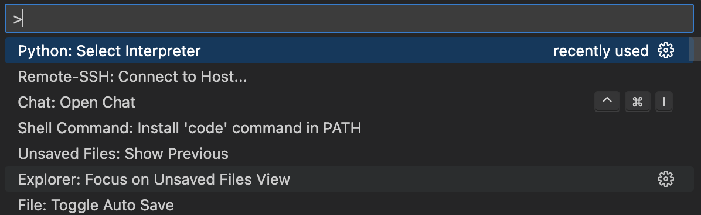
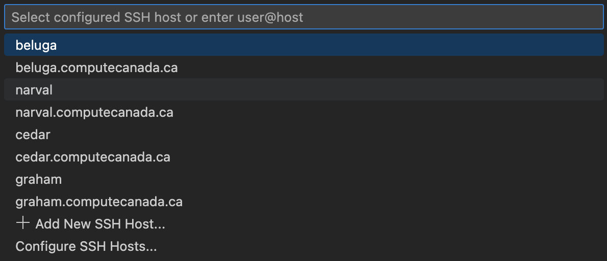
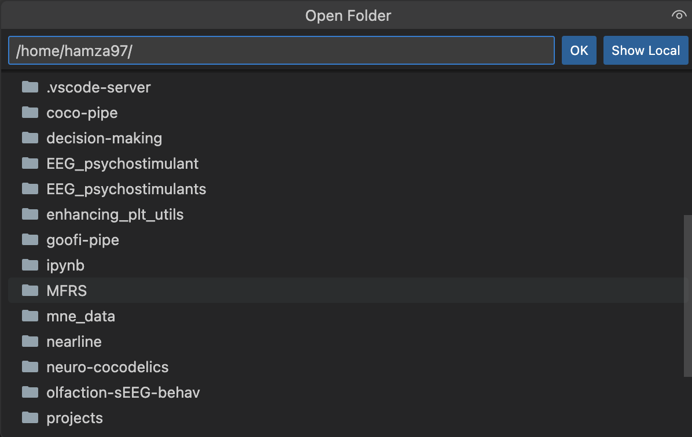
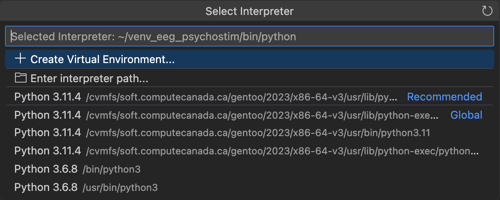

# Alliance Canada from Scratch

The Digital Research Alliance of Canada (Alliance Canada), previously known as ComputeCanada (CC), provides high-performance computing (HPC) infrastructure to support academic research across Canada. The computing facilities, also known as clusters, are operated by the Digital Research Alliance of Canada through regional partners.

This guide will walk you through the steps to access these cluster machines and run your first script.

## Table of Contents
1. [Getting Started](#getting-started)
   - [Account Setup](#account-setup)
   - [SSH Configuration](#ssh-configuration)
   - [Storage and Data Management](#storage-and-data-management)
2. [Running Jobs on Alliance Canada](#running-jobs-on-alliance-canada)
   - [Interactive Jobs (salloc)](#interactive-jobs-salloc)
   - [Scheduled Jobs (sbatch)](#scheduled-jobs-sbatch)
   - [Array Jobs](#array-jobs)
3. [Development Environments](#development-environments)
   - [Option 1: VS Code](#option-1-vs-code)
   - [Option 2: Jupyter Notebooks](#option-2-jupyter-notebooks)
4. [SLURM Best Practices and Tips](#slurm-best-practices-and-tips)
   - [Job Scheduling Strategies](#job-scheduling-strategies)
   - [Monitoring and Management](#monitoring-and-management)
   - [Performance Optimization](#performance-optimization)
   - [Common SLURM Directives](#common-slurm-directives)
   - [Troubleshooting Common Issues](#troubleshooting-common-issues)
5. [Acknowledgment](#acknowledgment)

## Getting Started

### Account Setup

#### Sponsorship
Access to the Alliance Canada clusters is granted through sponsorship by a Canadian academic. The only criterion is that the sponsoree must have some affiliation (e.g., Student or Collaborator). To obtain sponsorship:

1. **Register for an Account**: Visit the [CCDB (Alliance Canada Database)](https://ccdb.alliancecan.ca/security/login) and create an account. When prompted, request your sponsor's ID in the format `www-yyy-zz`.
2. **Approval**: After submitting your request, your sponsor (e.g., Professor Karim) will need to approve and activate your account.

#### Acknowledging Alliance Canada
If you use CalculQuebec / Alliance Canada resources in a paper or poster, please acknowledge them appropriately. For guidance on how to cite their contributions, refer to the [Alliance Canada Acknowledgment Guidelines](https://alliancecan.ca/en/services/advanced-research-computing/acknowledging-alliance).

### SSH Configuration

#### Basic Access
Once your account is approved, you will have access to most clusters (e.g., Beluga, Cedar). Connect to a cluster via SSH using the command: `ssh USERNAME@CLUSTER_NAME.alliancecan.ca`. To view the technical specifications of each cluster, visit [this link](https://alliancecan.ca/en/services/advanced-research-computing/national-services/clusters).

#### SSH Keys
To avoid entering your password each time you connect, set up [SSH keys](https://docs.alliancecan.ca/wiki/Using_SSH_keys_in_Linux).

#### Advanced SSH Configuration
For optimal VS Code integration, configure your SSH settings in `~/.ssh/config`:

```bash
# Default settings for all hosts
Host *
  ServerAliveInterval 300
  ForwardAgent yes

# Alliance / Compute Canada clusters (login nodes)
Host narval narval.alliancecan.ca
  User USERNAME
  HostName narval.alliancecan.ca
  IdentityFile ~/.ssh/RSA_KEY
  ControlPath ~/.ssh/cm-%r@%h:%p
  ControlMaster auto
  ControlPersist 10m
  ForwardAgent yes

Host fir fir.alliancecan.ca
  User USERNAME
  HostName fir.alliancecan.ca
  IdentityFile ~/.ssh/RSA_KEY
  ControlPath ~/.ssh/cm-%r@%h:%p
  ControlMaster auto
  ControlPersist 10m

Host nibi nibi.alliancecan.ca
  User USERNAME
  HostName nibi.alliancecan.ca
  IdentityFile ~/.ssh/RSA_KEY
  ControlPath ~/.ssh/cm-%r@%h:%p
  ControlMaster auto
  ControlPersist 10m

Host tamia tamia.alliancecan.ca
  User USERNAME
  HostName tamia.alliancecan.ca
  IdentityFile ~/.ssh/RSA_KEY
  ControlPath ~/.ssh/cm-%r@%h:%p
  ControlMaster auto
  ControlPersist 10m

Host rorqual rorqual.alliancecan.ca
  User USERNAME
  HostName rorqual.alliancecan.ca
  IdentityFile ~/.ssh/RSA_KEY
  ControlPath ~/.ssh/cm-%r@%h:%p
  ControlMaster auto
  ControlPersist 10m
  
Host trillium trillium.alliancecan.ca
  User USERNAME
  HostName trillium.alliancecan.ca
  IdentityFile ~/.ssh/RSA_KEY
  ControlPath ~/.ssh/cm-%r@%h:%p
  ControlMaster auto
  ControlPersist 10m

Host trillium-gpu trillium-gpu.alliancecan.ca
  User USERNAME
  HostName trillium-gpu.alliancecan.ca
  IdentityFile ~/.ssh/RSA_KEY
  ControlPath ~/.ssh/cm-%r@%h:%p
  ControlMaster auto
  ControlPersist 10m
  

# ProxyJump configurations for internal nodes

# Narval internal node patterns (examples: nc12345, ng00001, nl00001)
Host nc????? ng????? nl?????
  ProxyJump narval
  User USERNAME
  IdentityFile ~/.ssh/RSA_KEY
  ForwardAgent yes

# FIR internal nodes like fir1, fir02, etc. (but not the login node "fir")
Host fir[0-9]*
  ProxyJump fir
  User USERNAME
  IdentityFile ~/.ssh/RSA_KEY
  ForwardAgent yes

# NIBI internal nodes like nibi1, nibi02, etc.
Host nibi[0-9]*
  ProxyJump nibi
  User USERNAME
  IdentityFile ~/.ssh/RSA_KEY
  ForwardAgent yes

# TAMIA internal nodes like tamia1, tamia02, etc.
Host tc*
  ProxyJump tamia
  HostName %h.tamia.ecpia.ca
  User USERNAME
  IdentityFile ~/.ssh/RSA_KEY
  ForwardAgent yes

# RORQUAL internal nodes like rorqual1, rorqual02, etc.
Host rorqual[0-9]*
  ProxyJump rorqual
  User USERNAME
  IdentityFile ~/.ssh/RSA_KEY
  ForwardAgent yes

# TRILLIUM internal nodes like trillium1, trillium02, etc.
Host trillium[0-9]*
  ProxyJump trillium
  User USERNAME
  IdentityFile ~/.ssh/RSA_KEY
  ForwardAgent yes

# TRILLIUM-GPU internal nodes like trillium-gpu1, trillium-gpu02, etc.
Host trillium-gpu[0-9]*
  ProxyJump trillium-gpu
  User USERNAME
  IdentityFile ~/.ssh/RSA_KEY
  ForwardAgent yes
```

### Storage and Data Management

#### Directory Structure
To navigate to your main folder, use the command `cd projects/<sponsor_id>/<USERNAME>` in the terminal. There are different types of storage:

- **Home**: For personal use, offering 50 GB of permanent storage.
- **Scratch**: 20 TB of temporary storage with a 90-day expiry on unused data. Ideal for storing large files temporarily.
- **Project**: 1 TB of storage for the entire team. Suitable for securely storing important, large data permanently.

Use the `diskusage_report` command to quickly check the storage status of all disks. For more details, refer to [this link](https://docs.alliancecan.ca/wiki/Storage_and_file_management).

#### Data Transfer
To transfer data from a local system to a cluster or between clusters, use Globus, a graphical user interface tool. For more details, visit the [Globus Documentation](https://docs.globus.org/how-to/).

You can also use other programs like FileZilla or the command-line tool `rsync`.

For automatic synchronization between your local system and the cluster, refer to the [Alliance Canada Documentation](https://docs.alliancecan.ca/wiki/Transferring_data#Synchronizing_files).

### Data Sharing and Access Control

Alliance Canada provides fine-grained control over file and directory permissions using Access Control Lists (ACLs). This allows you to share data with specific users without making it accessible to everyone.

#### Access Control Lists (ACLs)

ACLs provide more granular control than traditional Unix permissions (owner, group, others). Two main commands are used to manage ACLs:

- `getfacl`: View current ACL permissions
- `setfacl`: Modify ACL permissions

#### Sharing with Individual Users

1. **Sharing a Single File**
   ```bash
   # Allow read and execute permission for a specific user
   setfacl -m u:username:rx my_script.py
   ```

2. **Sharing a Directory**
   ```bash
   # Allow read and write access to a directory and its contents
   # -d: Set default ACL for new files
   # -R: Apply recursively to existing files
   # -m: Modify ACL
   setfacl -d -m u:username:rwX /home/username/projects/def-<PI>/shared_data
   setfacl -R -m u:username:rwX /home/username/projects/def-<PI>/shared_data
   ```

3. **Viewing ACL Permissions**
   ```bash
   # Check current ACL settings
   getfacl my_script.py
   ```

4. **Removing ACL Permissions**
   ```bash
   # Remove all extended ACL attributes recursively
   setfacl -bR /home/username/projects/def-<PI>/shared_data
   ```

#### Data Sharing Groups

For more complex sharing scenarios involving multiple users across different clusters, you can create a data sharing group:

1. **Request Group Creation**
   - Email technical support to request creation of a data sharing group
   - Specify the desired group name and request ownership

2. **Manage Group Members**
   - Access the group through [CCDB Services](https://ccdb.alliancecan.ca/services/)
   - Add members to the group as needed

3. **Set Group Permissions**
   ```bash
   # Set execute permission for the group on parent directory
   chmod o+X /project/def-<PI>/
   # OR
   setfacl -m g:wg_datasharing:X /project/def-<PI>/

   # Set read/write/execute permissions for the group
   setfacl -d -m g:wg-datasharing:rwx /home/username/projects/def-<PI>/shared_data
   setfacl -R -m g:wg-datasharing:rwx /home/username/projects/def-<PI>/shared_data
   ```

#### Troubleshooting

1. **Check Read Access**
   ```bash
   # List all items not readable by you in a directory
   find <directory_name> ! -readable -ls
   ```

2. **Verify Physical Paths**
   ```bash
   # Get the physical path of a symlink
   realpath /home/username/projects/def-username/shared_data
   ```
   > **Note**: Physical paths may differ between clusters. Always verify paths when sharing across multiple clusters.

For more detailed information about data sharing, visit the [Alliance Documentation](https://docs.alliancecan.ca/wiki/Sharing_data).

## Running Jobs on Alliance Canada

### Interactive Jobs (salloc)
Interactive jobs allow you to run commands and scripts directly on the compute nodes. This is useful for:
- Testing and debugging code
- Running short computations
- Monitoring processes in real-time

```bash
# Basic interactive job request
salloc --time=01:00:00 --mem=4G --cpus-per-task=4 --account=def-kjerbi

# For GPU jobs
salloc --time=01:00:00 --mem=4G --cpus-per-task=4 --gres=gpu:1 --account=def-kjerbi

# For longer sessions
salloc --time=4:00:00 --mem=8G --cpus-per-task=8 --account=def-kjerbi
```

Once your job starts, you'll be connected to a compute node. You can then:
- Run Python scripts: `python my_script.py`
- Monitor processes: `top` or `htop`
- Check resource usage: `free -h`, `df -h`

### Scheduled Jobs (sbatch)
Scheduled jobs run in the background and are ideal for:
- Long-running computations
- Batch processing
- Parameter sweeps

1. **Create a Job Script**
   Create a file named `jobscript.sh`:
   ```bash
   #!/bin/bash
   #SBATCH --job-name=my_job
   #SBATCH --output=output_%j.txt
   #SBATCH --error=error_%j.txt
   #SBATCH --time=01:00:00
   #SBATCH --mem=4G
   #SBATCH --cpus-per-task=4
   #SBATCH --account=def-kjerbi

   # Load required modules
   module load python/3.8

   # Run your script
   python my_script.py
   ```

2. **Submit and Monitor**
   ```bash
   # Submit the job
   sbatch jobscript.sh

   # Check job status
   squeue -u $USER

   # View job details
   scontrol show job <job_id>
   ```

### Array Jobs
Array jobs are useful for running the same script with different parameters:

```bash
#!/bin/bash
#SBATCH --job-name=array_job
#SBATCH --output=output_%A_%a.txt
#SBATCH --error=error_%A_%a.txt
#SBATCH --array=0-9
#SBATCH --time=01:00:00
#SBATCH --mem=2G
#SBATCH --account=def-kjerbi

# Get the array index
INDEX=${SLURM_ARRAY_TASK_ID}

# Run script with different parameters
python my_script.py --param $INDEX
```

## Development Environments

### Option 1: VS Code
VS Code provides a full-featured IDE experience with debugging capabilities.

1. **Install VS Code**
   - Download from [vscode download](https://code.visualstudio.com/download)
   - Install the Remote-SSH extension

2. **Configure SSH (done in a previous step)**
   Add the following to your `~/.ssh/config`:
   ```bash
   Host narval narval.alliancecan.ca
     User USERNAME
     HostName narval.alliancecan.ca
     IdentityFile ~/.ssh/RSA_KEY
     ControlPath ~/.ssh/cm-%r@%h:%p
     ControlMaster auto
     ControlPersist 10m

   # Add similar configurations for other clusters
   ```

3. **Connecting to Alliance Canada**

   #### 3.1 Connect to Login Node
   Follow these steps to connect to a login node:

   1. **Open VS Code and Start Remote Connection**
      - Press `F1` or `Ctrl+Shift+P` to open the Command Palette
      
      - Type "Remote-SSH: Connect to Host..." and select it
      - You'll see a list of available clusters
      

   2. **Select and Connect to Cluster**
      - Click on your desired cluster from the list
      - Enter your password or passphrase when prompted
      - Complete the multi-factor authentication if required

   3. **Open Your Working Directory**
      - Once connected, you'll see the VS Code interface
      
      - Click "Open Folder"
      - Select your project folder
      
      > **Note**: It's recommended to open only your project folder rather than your entire home directory to avoid connection bottlenecks.

   4. **Configure Python Interpreter**
      - Press `F1` or `Ctrl+Shift+P` again
      
      - Type "Python: Select Interpreter" and select it
      - Choose your preferred Python environment

   5. **Close Connection When Done**
      - Press `F1` or `Ctrl+Shift+P`
      - Type "Remote-SSH: Close Remote Connection"

   #### 3.2 Connect to Compute Node
   To work on a compute node, follow these steps:

   1. **Start an Interactive Job**
      
      ```bash
      # Request an interactive job with sufficient memory
      salloc --time=2:00:00 --mem=4G --cpus-per-task=4 --account=def-kjerbi
      ```

   2. **Save SLURM Environment Variables (Optional)**
      ```bash
      # Save all SLURM environment variables to a file
      env | grep SLURM_ | sed -e 's/^\(.*\)=\(.*\)$/export \1="\2"/g' > slurm_var.sh
      ```

   3. **Connect to Compute Node in VS Code**
      - Instead of connecting to a cluster, enter the compute node name directly
      - Enter the compute node name (e.g., `cdr123`)
      - Select "Linux" when prompted for the operating system
      - If you saved SLURM variables, source them in the VS Code terminal:
        ```bash
        source slurm_var.sh
        ```

4. **Debugging Setup**
   ```bash
   # Create .vscode directory
   mkdir .vscode
   
   # Create launch.json
   {
     "version": "0.2.0",
     "configurations": [
       {
         "name": "Python: Current File",
         "type": "python",
         "request": "launch",
         "program": "${file}",
         "console": "integratedTerminal",
         "justMyCode": true
       }
     ]
   }
   ```

### Option 2: Jupyter Notebooks
If you prefer Jupyter Notebooks over VS Code:

1. **Create a Virtual Environment**
   ```bash
   python -m venv env
   source env/bin/activate
   pip install jupyter
   ```

2. **Start Jupyter**
   ```bash
   # Create startup script
   echo -e '#!/bin/bash\nunset XDG_RUNTIME_DIR\njupyter notebook --ip $(hostname -f) --no-browser' > $VIRTUAL_ENV/bin/notebook.sh
   chmod u+x $VIRTUAL_ENV/bin/notebook.sh
   
   # Start interactive job
   salloc --time=2:59:0 --ntasks=10 --nodes=1 --gres=gpu:2 --mem=30G --account=def-kjerbi
   
   # Start Jupyter
   $VIRTUAL_ENV/bin/notebook.sh
   ```

## SLURM Best Practices and Tips

### Job Scheduling Strategies

1. **Job Duration**
   - Request shorter durations (multiples of 3 hours) for faster allocation
   - Use `--time-min` to specify minimum runtime
   - Monitor actual runtime with `seff <job_id>`

2. **Resource Allocation**
   - Request only what you need (CPU, memory, GPU)
   - Use `--mem-per-cpu` instead of `--mem` for better scheduling
   - Consider using `--exclusive` for large jobs

3. **Job Arrays**
   - Use for parameter sweeps and similar tasks
   - Limit array size to 1000 tasks
   - Use `%` to limit concurrent tasks: `--array=1-1000%100`

### Monitoring and Management

1. **Job Status**
   ```bash
   # View your jobs
   squeue -u $USER
   
   # Detailed job information
   scontrol show job <job_id>
   
   # Job efficiency
   seff <job_id>
   ```

2. **Resource Usage**
   ```bash
   # Check CPU usage
   top
   
   # Check memory usage
   free -h
   
   # Check disk usage
   df -h
   ```

3. **Job Control**
   ```bash
   # Cancel a job
   scancel <job_id>
   
   # Hold a job
   scontrol hold <job_id>
   
   # Release a held job
   scontrol release <job_id>
   ```

### Performance Optimization

1. **I/O Optimization**
   - Use `$SLURM_TMPDIR` for temporary files
   - Minimize file operations
   - Use parallel I/O when possible

2. **Memory Management**
   - Monitor memory usage with `top` or `htop`
   - Use `--mem-per-cpu` for better memory allocation
   - Consider using `--mem-bind=local` for NUMA systems

3. **CPU Utilization**
   - Use `--cpus-per-task` for multi-threaded applications
   - Consider `--exclusive` for CPU-intensive jobs
   - Monitor CPU usage with `top` or `htop`

### Common SLURM Directives

```bash
# Basic job configuration
#SBATCH --job-name=my_job
#SBATCH --output=output_%j.txt
#SBATCH --error=error_%j.txt
#SBATCH --time=01:00:00
#SBATCH --mem=4G
#SBATCH --cpus-per-task=4

# Advanced options
#SBATCH --mail-type=BEGIN,END,FAIL
#SBATCH --mail-user=your.email@example.com
#SBATCH --account=def-kjerbi
#SBATCH --partition=compute
#SBATCH --gres=gpu:1
```

### Troubleshooting Common Issues

1. **Job Fails to Start**
   - Check resource availability
   - Verify account permissions
   - Check for syntax errors in job script

2. **Job Runs Slowly**
   - Monitor resource usage
   - Check for I/O bottlenecks
   - Verify CPU/memory allocation

3. **Job Gets Killed**
   - Check memory limits
   - Verify time limits
   - Look for error messages in output files

## Acknowledgment 
This tutorial was based on previous materials created by Anirudh ([doc](https://docs.google.com/document/d/1w_qt5vfLQc116Ha8rJ5qDLqSrn5JyHQBeKEv3rby7DI/edit) and [git](https://github.com/anirudhk686/install-setup-instructions/blob/master/cluster%2Bjupyter%2Batom.txt)) and Arthur ([git](https://github.com/arthurdehgan/calQ_examples/tree/master)).